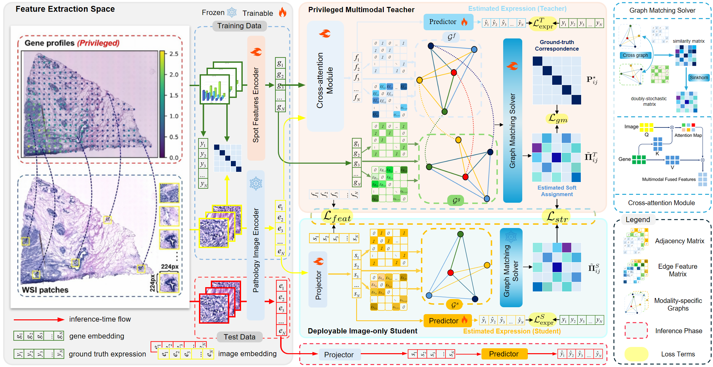

# G-CoDE

***
**Graph-Correspondence Distillation for Gene Expression Prediction via Privileged Spatial Transcriptomics.

Yichen Dai, Yuanyuan Chen, Yong Xia*
***

*Summary*: We propose G-CoDE, a novel privileged learning framework for robust image-to-gene expression prediction. G-CoDE introduces a differentiable graph matching regularizer to enforce cross-modal topological consistency between H&E images and privileged ST data, and a structure-preserving distillation module to transfer both feature-level and topological-level knowledge to a deployable image-only student model. Extensive experiments on three public ST datasets demonstrate that G-CoDE achieves SOTA performance, with significant improvements in both prediction accuracy and biological plausibility. Our method unlocks the potential for low-cost, high-throughput spatial transcriptomic profiling from routine H&E slides, with broad applications in computational pathology and biomedical research

